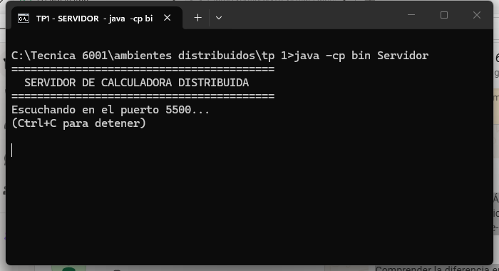
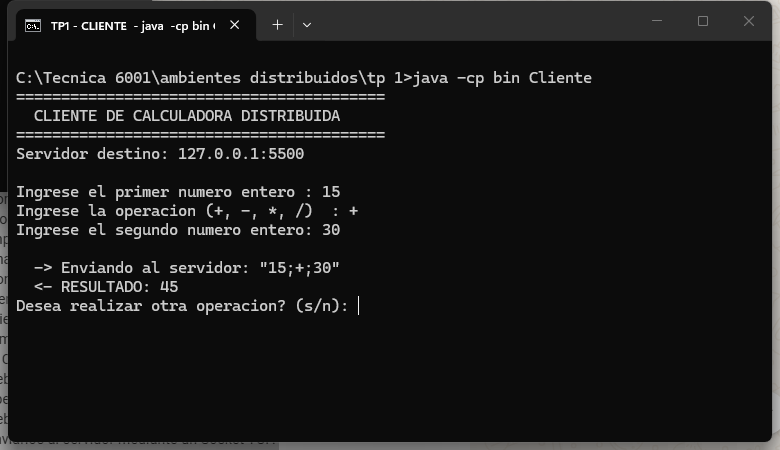
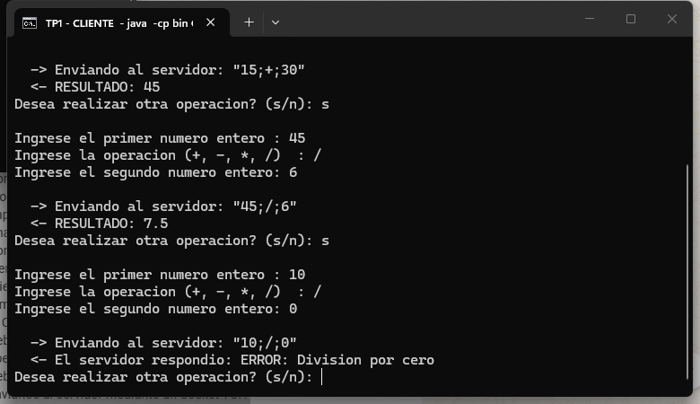
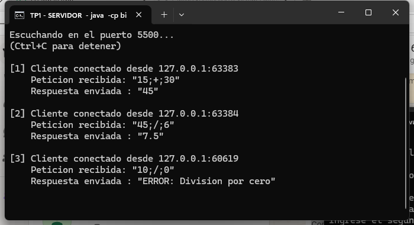
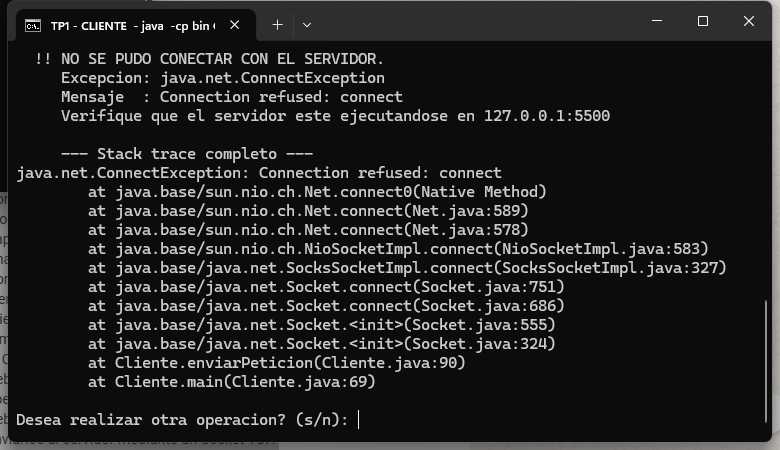

# Ambientes Distribuidos — Trabajos Prácticos

**Materia:** Desarrollo de Aplicaciones para Ambientes Distribuidos
**Alumno:** Ignacio Ruiz — DNI 39.040.338

| TP | Tema | Dónde está |
|---|---|---|
| **TP1** | Calculadora cliente-servidor con sockets TCP | Este README + [INFORME.md](INFORME.md) |
| **TP2** | Reintentos con espera creciente y jitter | [TP2/](TP2/) |
| **TP3** | Chat multihilo (TCP) y alertas con timeout (UDP) | [TP3/](TP3/) |
| **TP4** | Mandar datos por la red: JSON vs Binario | [TP4/](TP4/) |
| **TP5** | Modelo de Actores: sensores y procesador | [TP5/](TP5/) |
| **TP6** | Servidor de procesamiento con Java RMI | [TP6/](TP6/) |

---

## Contenido del repositorio

```
.
├── src/            TP1: Servidor.java y Cliente.java
├── capturas/       TP1: capturas de pantalla
├── INFORME.md      TP1: respuestas a las preguntas
├── TP2/            TP2 completo (código, capturas y README)
├── TP3/            TP3 completo (código, capturas y README)
├── TP4/            TP4 completo (código, capturas y README)
├── TP5/            TP5 completo (código, capturas y README)
├── TP6/            TP6 completo (código, capturas y README)
└── README.md       Este archivo
```

---

# TP1 — Calculadora distribuida

Un cliente le manda una cuenta a un servidor (por ejemplo `15 + 30`), el
servidor la resuelve y le devuelve el resultado. Se comunican por red usando
**sockets TCP**.

## Requisitos

Java 8 o superior (probado con JDK 21). Para verificar: `java -version`

## Compilar

Desde la raíz del repositorio:

```bash
javac -d bin src/Servidor.java src/Cliente.java
```

## Ejecutar

Hacen falta **dos terminales**. Primero el servidor, después el cliente.

**Terminal A — servidor:**

```bash
java -cp bin Servidor
```

Queda esperando conexiones en el puerto 5500. Se corta con `Ctrl+C`.

**Terminal B — cliente:**

```bash
java -cp bin Cliente                      # se conecta a esta misma compu
java -cp bin Cliente 192.168.0.142 5500   # se conecta a otra compu de la red
```

El cliente pide los dos números y la operación, y muestra el resultado.

Para usarlo entre dos notebooks hay que abrir el puerto 5500 en el firewall.
Está explicado en la [pregunta 3 del informe](INFORME.md#pregunta-3--qué-hay-que-cambiar-para-usarlo-entre-dos-notebooks-en-el-wi-fi-del-aula).

## Cómo se hablan

Se mandan una línea de texto:

| Quién | Formato | Ejemplo |
|---|---|---|
| Cliente → Servidor | `numero1;operador;numero2` | `15;+;30` |
| Servidor → Cliente | el resultado | `45` |
| Si hay un error | `ERROR: <qué pasó>` | `ERROR: Division por cero` |

Operaciones: `+`, `-`, `*`, `/`

Errores que contesta el servidor:

| Caso | Respuesta |
|---|---|
| Dividir por cero | `ERROR: Division por cero` |
| Formato mal escrito | `ERROR: Formato invalido. Se esperaba numero1;operador;numero2` |
| Algo que no es número | `ERROR: Los operandos deben ser numeros enteros` |
| Operación que no existe | `ERROR: Operador no soportado. Use + - * /` |

## Capturas

### 1. Servidor esperando conexiones



### 2. Una suma (15 + 30)

Se ve lo que pide el cliente, el texto `"15;+;30"` que manda, y el `45` que vuelve.



### 3. Varias cuentas y la división por cero

`45 / 6 = 7.5` y, con `10 / 0`, el servidor contesta con un mensaje de error en
vez de romperse.



### 4. Lo que registra el servidor

Cada conexión viene de un puerto distinto (`56549`, `56553`, `56555`): cada
cuenta abre una conexión nueva.



### 5. Cliente con el servidor apagado

Sale el error `ConnectException: Connection refused` (se usa en la pregunta 1
del informe).



## Detalles

- El servidor atiende **de a un cliente por vez**, sin hilos.
- **Cada cuenta usa su propia conexión**: se abre, se usa y se cierra.
- Las conexiones se cierran solas aunque haya un error (`try-with-resources`).
- **Si un cliente falla, el servidor sigue andando** y atiende al siguiente.
- Los errores se mandan como texto, así el cliente siempre recibe respuesta.
