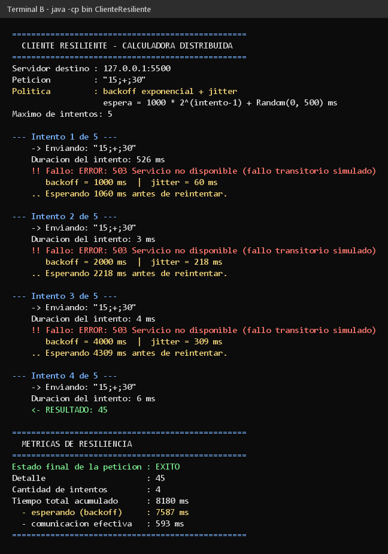
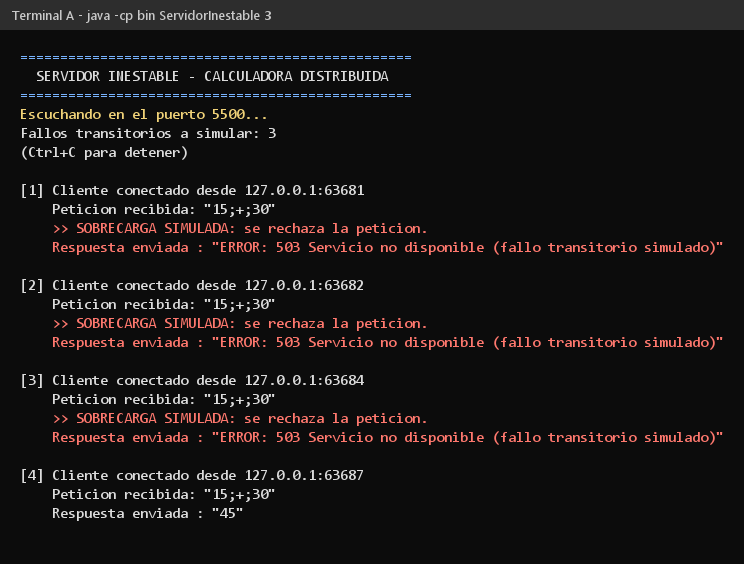
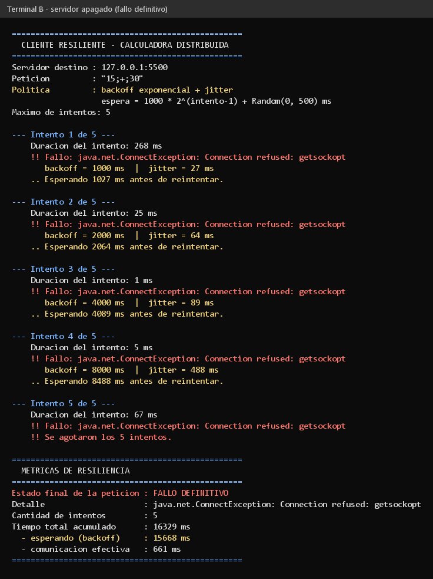
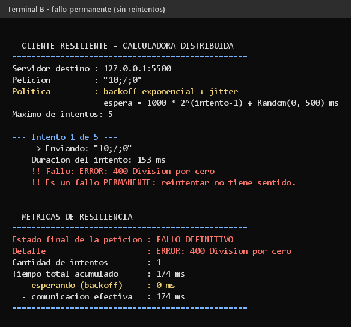

# TP2 — Reintentos con espera creciente y Jitter

Trabajo Práctico N° 2 — Desarrollo de Aplicaciones para Ambientes Distribuidos.

Sigue la calculadora del [TP1](../README.md). Ahora la pregunta es: **¿qué hace
el cliente cuando el servidor falla?** Lo vuelve a intentar, esperando cada vez
un poco más, y al final muestra cuánto tardó.

---

## Archivos

```
TP2/
├── src/
│   ├── ClienteResiliente.java   Cliente que reintenta si algo falla
│   └── ServidorInestable.java   Servidor que falla a propósito las primeras veces
├── capturas/                    Capturas y salidas reales de las pruebas
└── README.md                    Este archivo
```

---

## Cómo compilar y ejecutar

```bash
# desde la raíz del repositorio
javac -d TP2/bin TP2/src/ServidorInestable.java TP2/src/ClienteResiliente.java
```

**Terminal A — servidor:**

```bash
java -cp TP2/bin ServidorInestable 3   # falla las 3 primeras veces, después anda
java -cp TP2/bin ServidorInestable 0   # no falla nunca
```

**Terminal B — cliente:**

```bash
java -cp TP2/bin ClienteResiliente [host] [puerto] [pedido]

java -cp TP2/bin ClienteResiliente
java -cp TP2/bin ClienteResiliente 127.0.0.1 5500 "10;/;0"
```

---

## Ejercicio 1 — Jitter

Entre intento e intento, el cliente espera:

```
Espera = 1000 × 2^(intento-1) + un número al azar entre 0 y 500 ms
```

La primera parte hace que la espera **se duplique** cada vez. La parte al azar
(el **jitter**) hace que no todos los clientes esperen exactamente lo mismo.

```java
private static long calcularEspera(int intento) {
    long backoffExponencial = BASE_MS * (long) Math.pow(2, intento - 1);
    int jitter = RANDOM.nextInt(JITTER_MAX_MS + 1);
    return backoffExponencial + jitter;
}
```

| Intento | Espera fija | Al azar | Total |
|---|---|---|---|
| 1 → 2 | 1000 ms | 0 – 500 ms | 1000 – 1500 ms |
| 2 → 3 | 2000 ms | 0 – 500 ms | 2000 – 2500 ms |
| 3 → 4 | 4000 ms | 0 – 500 ms | 4000 – 4500 ms |
| 4 → 5 | 8000 ms | 0 – 500 ms | 8000 – 8500 ms |

### ¿Cuándo reintenta y cuándo no?

| Qué pasó | ¿Reintenta? |
|---|---|
| No se pudo conectar / se cortó / tardó demasiado | Sí |
| El servidor contestó `ERROR: 503` (está sobrecargado) | Sí |
| El servidor contestó `ERROR: 400` (el pedido está mal, ej. dividir por 0) | **No** |
| Llegó el resultado | No hace falta |

Si el pedido está mal, va a fallar siempre. No tiene sentido reintentar.

---

## Ejercicio 2 — Métricas

Al terminar, el cliente muestra un resumen:

```
Estado final de la peticion : EXITO
Detalle                     : 45
Cantidad de intentos        : 4
Tiempo total acumulado      : 8180 ms
  - esperando (backoff)     : 7587 ms
  - comunicacion efectiva   : 593 ms
```

- **Estado final:** `EXITO` o `FALLO DEFINITIVO`.
- **Intentos:** cuántas veces se conectó.
- **Tiempo total:** desde el primer intento hasta el último.

Se agregó también cuánto tiempo fue espera y cuánto fue trabajo real. En el
ejemplo, casi todo (7587 ms) fue espera. Por eso hay un máximo de 5 intentos.

---

## Capturas

### 1. El cliente se recupera

Falla 3 veces (`503`) y a la cuarta funciona. La espera crece (1000 → 2000 →
4000 ms) y el número al azar cambia cada vez.



### 2. Lo que ve el servidor

Cuatro conexiones: rechaza las tres primeras y la cuarta la responde.



### 3. Servidor apagado

Los 5 intentos fallan y el cliente termina con `FALLO DEFINITIVO`.



### 4. Pedido mal hecho: no reintenta

`10;/;0` da `ERROR: 400`. El cliente corta en el primer intento, sin esperar.



> Las salidas completas también están como `.txt` en `capturas/`.

---

## Ejercicio 3 — Preguntas

### Pregunta 1 — ¿Qué pasa si todos los clientes reintentan al mismo tiempo y con el mismo intervalo?

Se produce el **efecto estampida** (*Thundering Herd*).

Imaginemos que el servidor se cae. Le falla a todos los clientes **en el mismo
momento**. Si todos esperan, por ejemplo, 2 segundos fijos, **todos vuelven al
mismo tiempo**. El servidor recibe una avalancha de pedidos juntos, se vuelve a
caer, y así una y otra vez. El servidor no se puede recuperar porque los
propios clientes lo tiran abajo.

Duplicar la espera ayuda, pero no alcanza: si todos duplican igual, siguen
llegando todos juntos, solo que más espaciados.

**La solución es el jitter**: sumarle un tiempo al azar. Así cada cliente vuelve
en un momento distinto y los pedidos llegan repartidos.

```
Sin jitter                          Con jitter
carga |  #     #     #              carga | ###   ###   ###
      |  #     #     #                    | ###   ###   ###
      +--+-----+-----+--- tiempo          +-+-----+-----+--- tiempo
  todos juntos: el servidor se cae    repartidos: el servidor aguanta
```

Otras ayudas: poner un máximo de intentos (como acá) y un tope a la espera.

### Pregunta 2 — ¿Qué diferencia hay entre un fallo transitorio y uno permanente?

| | **Transitorio** | **Permanente** |
|---|---|---|
| Qué es | Un problema momentáneo | Un problema que no se arregla solo |
| ¿Sirve reintentar? | **Sí** | **No** |
| Ejemplo cotidiano | "La línea está ocupada" | "El número no existe" |
| Ejemplo real | Un servidor sobrecargado (`503`), un corte de red | Pedir un usuario que no existe (`404`), datos mal enviados (`400`) |
| En este TP | `ERROR: 503` → el cliente reintenta (captura 1) | `ERROR: 400 Division por cero` → corta enseguida (captura 4) |

**Por qué importa:**

- Si tratás un fallo **transitorio** como permanente, te rendís antes de tiempo
  y perdés algo que iba a funcionar.
- Si tratás un fallo **permanente** como transitorio, reintentás de gusto:
  gastás recursos, el usuario espera más y encima sumás carga al servidor.

Por eso el servidor manda el código (`503` o `400`): así el cliente sabe si
tiene sentido volver a probar.

---

## Detalles

- El cliente pone un **tiempo máximo para conectarse** (5 s). Si no, con una IP
  que no responde podría quedarse colgado mucho tiempo.
- También pone un **tiempo máximo para esperar la respuesta** (5 s), por si el
  servidor se conecta pero nunca contesta.
- El servidor sigue atendiendo de a uno, como en el TP1. Todo lo de reintentar
  lo hace el cliente.

---

## Autor

Ignacio Ruiz — DNI 39.040.338
Trabajo Práctico N° 2 — Desarrollo de Aplicaciones para Ambientes Distribuidos
