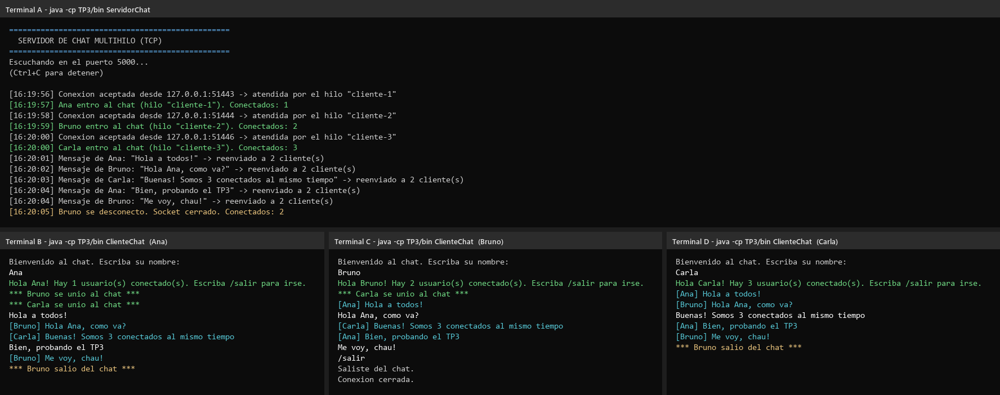
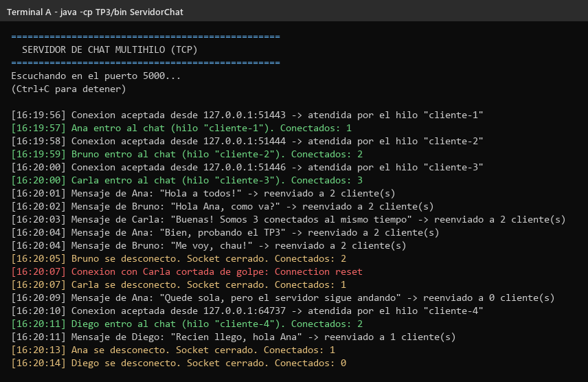
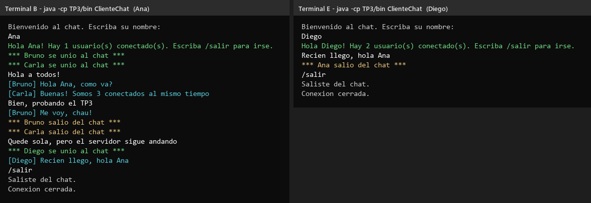
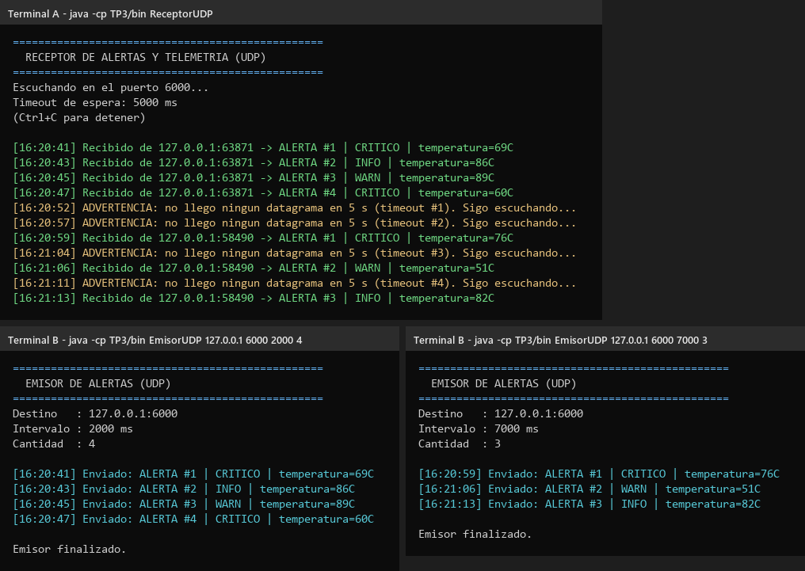
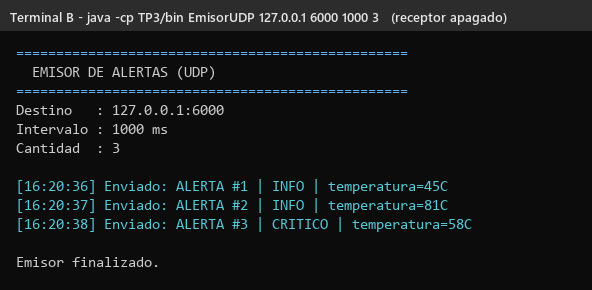

# TP3 — Chat multihilo (TCP) y alertas por UDP

Trabajo Práctico N° 3 — Desarrollo de Aplicaciones para Ambientes Distribuidos.

Dos programas:

1. **Un chat** donde varias personas se conectan a un servidor y todo lo que
   escribe una le llega a las demás (usa TCP).
2. **Un sistema de alertas**: un programa manda avisos cada tantos segundos y
   otro los recibe. Si pasa mucho tiempo sin recibir nada, avisa (usa UDP).

---

## Archivos

```
TP3/
├── src/
│   ├── ServidorChat.java   Servidor del chat (puerto 5000)
│   ├── ClienteChat.java    Cliente del chat
│   ├── EmisorUDP.java      Manda alertas cada X tiempo
│   └── ReceptorUDP.java    Recibe las alertas (puerto 6000)
├── capturas/               Capturas y salidas reales de las pruebas
└── README.md               Este archivo
```

---

## Cómo compilar

Hace falta Java 8 o superior. Desde la carpeta raíz del repositorio:

```bash
javac -d TP3/bin TP3/src/*.java
```

---

## Cómo ejecutar el chat (Ejercicio 1)

Abrí **una terminal para el servidor** y **una terminal por cada cliente**.

**Paso 1 — Levantar el servidor:**

```bash
java -cp TP3/bin ServidorChat
```

**Paso 2 — Abrir cada cliente (en otra terminal):**

```bash
java -cp TP3/bin ClienteChat
```

**Paso 3 —** El cliente te pide un nombre. Después escribís mensajes y Enter.
Para salir escribís `/salir`.

Para conectarte a un servidor en otra compu: `java -cp TP3/bin ClienteChat <IP> 5000`

### Cómo funciona

- El servidor espera conexiones. Cada vez que entra alguien, **le crea un hilo
  propio** para atenderlo. Así puede atender a muchos a la vez.
- Cuando alguien manda un mensaje, el servidor **se lo reenvía a todos los
  demás** (broadcast).
- Si alguien se va (con `/salir` o cerrando la ventana de golpe), el servidor
  cierra su conexión, avisa a los demás y **sigue funcionando** normalmente.
- El cliente también usa dos hilos: uno para leer lo que escribís y otro para
  mostrar los mensajes que llegan. Así podés recibir mensajes mientras escribís.

---

## Cómo ejecutar las alertas UDP (Ejercicio 2)

**Paso 1 — Levantar el receptor:**

```bash
java -cp TP3/bin ReceptorUDP
```

**Paso 2 — En otra terminal, el emisor:**

```bash
java -cp TP3/bin EmisorUDP [host] [puerto] [intervalo_ms] [cantidad]

# ejemplos
java -cp TP3/bin EmisorUDP                            # una alerta cada 2 s, sin fin
java -cp TP3/bin EmisorUDP 127.0.0.1 6000 2000 4      # 4 alertas, una cada 2 s
java -cp TP3/bin EmisorUDP 127.0.0.1 6000 7000 3      # 3 alertas, una cada 7 s
```

### Cómo funciona

- El emisor arma un mensaje tipo `ALERTA #1 | CRITICO | temperatura=69C` y lo
  manda en un paquete UDP. No espera respuesta.
- El receptor tiene puesto `setSoTimeout(5000)`: espera como mucho 5 segundos.
  Si en ese tiempo no llega nada, salta una `SocketTimeoutException`. El
  programa la atrapa, muestra una **ADVERTENCIA** y sigue escuchando.

---

## Capturas

> En los clientes, las líneas en color blanco son lo que escribió el usuario.
> Las salidas completas también están como `.txt` en `capturas/`.

### 1. Tres clientes conectados al mismo tiempo

Ana, Bruno y Carla están conectados a la vez. Arriba, el servidor muestra que
cada uno tiene **su propio hilo** (`cliente-1`, `cliente-2`, `cliente-3`) y que
cada mensaje se reenvía a los otros 2. Abajo se ve que a cada uno le llega lo
que escriben los demás.



### 2. Desconexiones: el servidor no se cae

Log completo del servidor. Bruno sale con `/salir`. A Carla se le cierra el
programa de golpe (`Connection reset`). En los dos casos el servidor cierra el
socket, avisa y **sigue atendiendo**: después entra Diego sin problema.



### 3. Los demás clientes se enteran

Ana ve que Bruno y Carla se fueron y que después llegó Diego.



### 4. Receptor UDP con timeout

Primero llegan 4 alertas seguidas (cada 2 s). Cuando el emisor termina, pasan 5
segundos sin nada y aparece la **ADVERTENCIA**, pero el receptor sigue
escuchando. Después un emisor más lento (cada 7 s) hace que entre alerta y
alerta salte el timeout.



### 5. Emisor UDP sin receptor

Con el receptor apagado, el emisor manda igual las 3 alertas y dice "Enviado"
sin ningún error. Los paquetes se perdieron y **el emisor nunca se enteró**.
Esto sirve para la pregunta 3.



---

## Cuestionario teórico

### 1. ¿Qué diferencia hay entre TCP (con conexión) y UDP (sin conexión)?

| | **TCP** | **UDP** |
|---|---|---|
| Antes de hablar | Se "conectan" primero (como una llamada telefónica) | No hay conexión, se manda y listo (como una carta) |
| ¿Llega seguro? | Sí. Si algo se pierde, lo vuelve a mandar solo | No. Si se pierde, se pierde |
| ¿Llega en orden? | Sí | No necesariamente |
| Forma de los datos | Un chorro continuo de datos | Paquetes sueltos e independientes |
| Velocidad | Más lento (controla todo) | Más rápido y liviano |
| En Java | `ServerSocket` y `Socket` | `DatagramSocket` y `DatagramPacket` |
| En este TP | El chat: no se puede perder ningún mensaje | Las alertas: si se pierde una, llega la próxima |

En resumen: **TCP es confiable pero más pesado; UDP es rápido pero no garantiza
nada.** Con UDP, si hace falta controlar algo (como saber si llegan los datos),
lo tiene que hacer el propio programa.

### 2. ¿Para qué sirve `ServerSocket.accept()`? ¿Por qué hace falta un hilo por cliente?

`accept()` **se queda esperando** hasta que un cliente se conecta. Cuando eso
pasa, devuelve un `Socket` nuevo que sirve para hablar solamente con ese
cliente. El `ServerSocket` original queda libre para esperar al siguiente.

**Por qué un hilo por cliente:** atender a un cliente también implica esperar
(por ejemplo, `readLine()` se queda frenado hasta que el cliente escribe algo).
Si el servidor hiciera todo en un solo hilo:

- Mientras espera que Ana escriba, **no puede volver a `accept()`**, así que
  nadie más puede entrar.
- Tampoco podría leer lo que escribe Bruno, porque está trabado esperando a Ana.

Con un hilo por cliente, cada uno espera por su lado y el hilo principal queda
libre para seguir aceptando gente. Es lo que se ve en la captura 1: tres
clientes atendidos a la vez por tres hilos distintos.

### 3. ¿Qué pasa si se pierde un paquete UDP? ¿Cómo lo detecta el receptor con `setSoTimeout()`?

**Qué pasa:** el paquete simplemente desaparece. UDP no confirma que llegó ni
lo vuelve a mandar. El emisor no se entera de nada (captura 5) y el receptor
no recibe ningún error, solo **no le llega nada**.

**Cómo lo detecta el receptor:** sin timeout, `receive()` se quedaría esperando
para siempre. Con `setSoTimeout(5000)`, si pasan 5 segundos sin recibir nada,
Java lanza una `SocketTimeoutException`. El receptor la atrapa, muestra una
advertencia y vuelve a escuchar (captura 4).

Ojo: el timeout **no dice qué paquete se perdió**, solo que pasó demasiado
tiempo sin noticias. Puede ser que se perdió un paquete, que el emisor se
apagó o que la red se cortó. Como las alertas salen cada pocos segundos, si
pasan 5 sin nada es señal de que algo anda mal.

---

## Autor

Ignacio Ruiz — DNI 39.040.338
Trabajo Práctico N° 3 — Desarrollo de Aplicaciones para Ambientes Distribuidos
