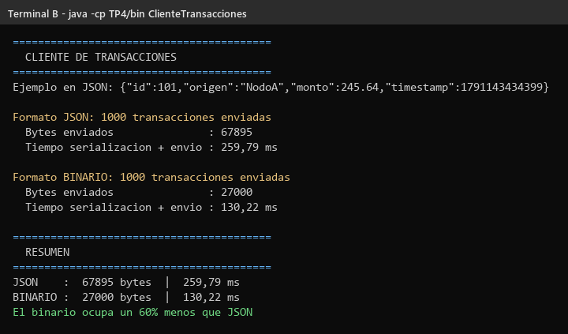
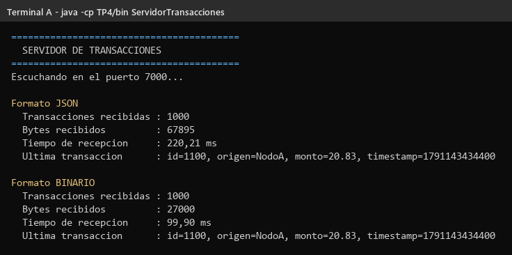

# TP4 — JSON vs Binario

Trabajo Práctico N° 4 — Desarrollo de Aplicaciones para Ambientes Distribuidos.

Un cliente le manda 1000 transacciones a un servidor, primero en **JSON**
(texto) y después en **binario** (bytes), y se compara cuánto ocupa y cuánto
tarda cada forma.

---

## Archivos

```
TP4/
├── src/
│   ├── Transaccion.java             La clase con los datos
│   ├── ParserMensajes.java          Pasa la transacción a JSON o a binario (y al revés)
│   ├── ServidorTransacciones.java   Recibe las transacciones (puerto 7000)
│   └── ClienteTransacciones.java    Manda las 1000 transacciones
├── capturas/
└── README.md
```

---

## Cómo ejecutarlo

Desde la carpeta raíz del repositorio:

```bash
javac -d TP4/bin TP4/src/*.java
```

**Terminal A — servidor:**

```bash
java -cp TP4/bin ServidorTransacciones
```

**Terminal B — cliente:**

```bash
java -cp TP4/bin ClienteTransacciones
```

---

## Cómo funciona

La clase `Transaccion` tiene 4 datos: `idTransaccion` (int), `origen`
(String), `monto` (double) y `timestamp` (long).

`ParserMensajes` la convierte de dos formas:

- **JSON:** arma un texto así:
  `{"id":101,"origen":"NodoA","monto":245.64,"timestamp":1791143434399}`
- **Binario:** con `DataOutputStream` escribe los datos directo como bytes
  (`writeInt`, `writeUTF`, `writeDouble`, `writeLong`).

El servidor recibe cada mensaje y lo vuelve a convertir en una `Transaccion`
(con `desdeJson` o `desdeBinario`).

---

## Resultados

| Formato | Tamaño total | Tiempo (serialización + envío) |
|---|---|---|
| JSON | 67 895 bytes | 259,79 ms |
| Binario | 27 000 bytes | 130,22 ms |

**El binario ocupa un 60 % menos y tardó la mitad.**

Los tiempos pueden cambiar un poco cada vez que se ejecuta. El tamaño no.

### ¿Por qué el binario es más chico?

En JSON se manda todo como texto: los nombres de los campos (`"id"`,
`"monto"`...), las comillas y cada número dígito por dígito. Por ejemplo, el
timestamp `1791143434399` ocupa 13 bytes.

En binario solo van los datos: un `int` ocupa siempre 4 bytes, y un `double`
o un `long`, 8 bytes. Cada transacción ocupa 27 bytes en binario y unos 68 en
JSON.

### Entonces, ¿cuál conviene?

- **JSON** se puede leer a simple vista y lo entiende cualquier lenguaje. Por
  eso se usa en casi todas las páginas y APIs web.
- **Binario** es más chico y más rápido, pero no se puede leer, y los dos lados
  tienen que saber en qué orden van los datos.

---

## Capturas

### Cliente



### Servidor

Recibe las 1000 en cada formato. La última transacción llega igual en los dos
formatos, así que los datos llegaron bien.



---

## Autor

Ignacio Ruiz — DNI 39.040.338
Trabajo Práctico N° 4 — Desarrollo de Aplicaciones para Ambientes Distribuidos
