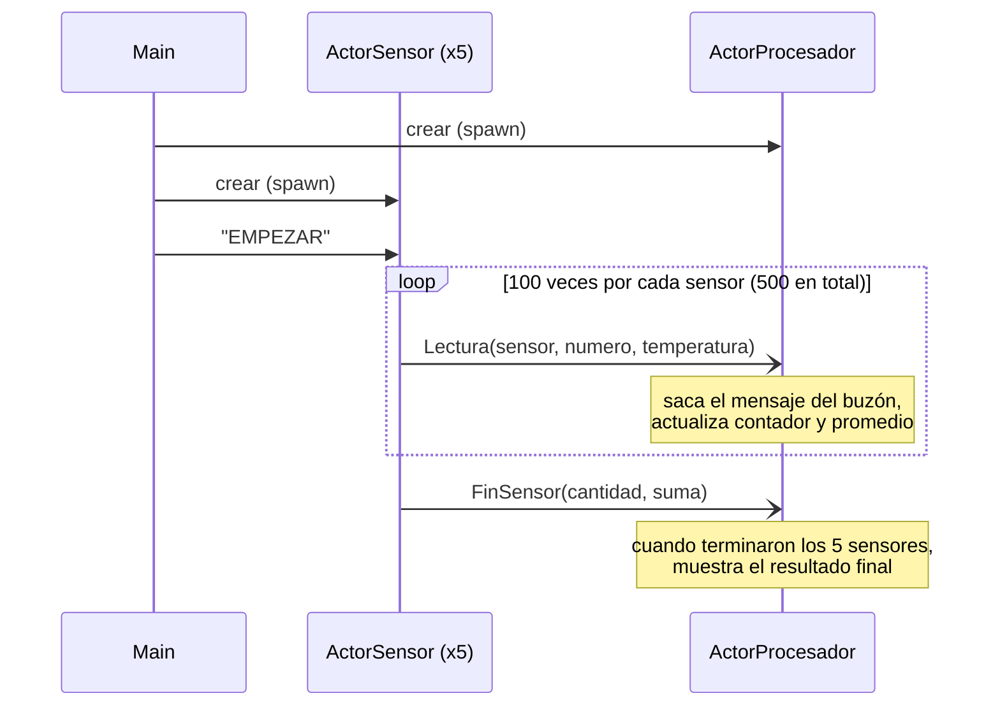
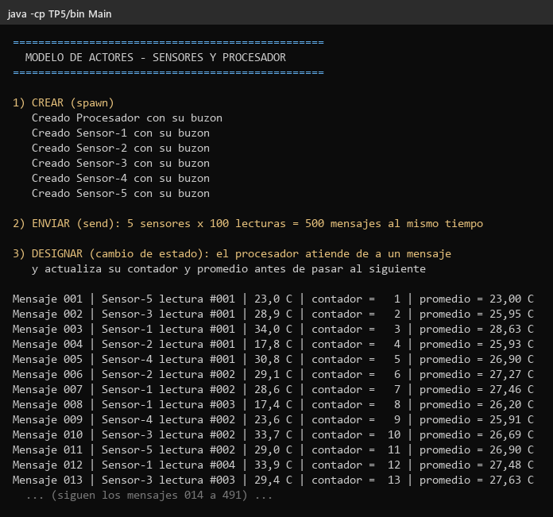
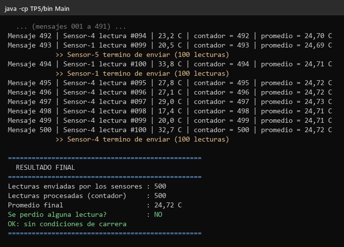

# TP5 — Modelo de Actores

Trabajo Práctico N° 5 — Desarrollo de Aplicaciones para Ambientes Distribuidos.

5 sensores mandan lecturas de temperatura **al mismo tiempo** a un procesador.
El procesador las va atendiendo **de a una** desde su buzón y calcula el
promedio. No se usa `synchronized`, ni locks, ni variables compartidas: los
actores solo se comunican **mandándose mensajes**.

---

## Archivos

```
TP5/
├── src/
│   ├── Actor.java            Base de todo actor: tiene un buzón y un hilo propio
│   ├── ActorSensor.java      Genera lecturas y se las manda al procesador
│   ├── ActorProcesador.java  Recibe las lecturas y calcula contador y promedio
│   ├── Lectura.java          Mensaje con una lectura (no se puede modificar)
│   ├── FinSensor.java        Mensaje que avisa que un sensor terminó
│   └── Main.java             Crea los actores y arranca todo
├── capturas/
└── README.md
```

---

## Cómo ejecutarlo

Desde la carpeta raíz del repositorio:

```bash
javac -d TP5/bin TP5/src/*.java
java -cp TP5/bin Main
```

---

## Cómo funciona

- **Cada actor tiene un buzón** (una cola donde le llegan los mensajes) y
  **un hilo propio** que saca los mensajes de a uno, en el orden en que
  llegaron (FIFO).
- **Los mensajes no se pueden modificar** (`Lectura` y `FinSensor` tienen todos
  sus campos `final`). Así nadie puede cambiar un mensaje después de mandarlo.
- **El contador y el promedio son privados del procesador.** Nadie de afuera
  los puede leer ni cambiar. Solo los toca el hilo del procesador.
- Cada sensor manda 100 lecturas y al final un mensaje `FinSensor` con cuántas
  mandó y cuánto sumaban. Cuando el procesador recibió el aviso de los 5,
  compara con lo que él contó y muestra el resultado.

### Las 3 operaciones

| Operación | Dónde se ve |
|---|---|
| **Crear** (spawn) | `Main` crea el procesador y los 5 sensores, cada uno con su buzón |
| **Enviar** (send) | Los 5 sensores mandan sus 100 lecturas a la vez: **500 mensajes** |
| **Designar** (cambio de estado) | Por cada mensaje, el procesador actualiza su contador y su promedio, y recién después atiende el siguiente |

### ¿Por qué no hay condiciones de carrera?

Una condición de carrera pasa cuando dos hilos modifican la misma variable al
mismo tiempo y se pisan. Acá eso no puede pasar: los sensores **no tocan** el
contador, solo dejan mensajes en el buzón. El único que modifica el contador es
el hilo del procesador, y lo hace **de a un mensaje por vez**.

---

## Diagrama de secuencia



Las flechas `-)` son mensajes **asincrónicos**: el sensor deja el mensaje en el
buzón y sigue, sin esperar a que el procesador lo atienda.

---

## Capturas

### Inicio

Se crean los actores y empiezan a llegar los mensajes. Los sensores aparecen
**mezclados** (5, 3, 1, 2, 4...) porque mandan al mismo tiempo, pero el
procesador los atiende **de a uno**: el contador sube de 1 en 1.



### Final

Llegan los últimos mensajes y el resultado: **500 enviadas, 500 procesadas**,
no se perdió ninguna.



> La salida completa con los 500 mensajes está en `capturas/salida-completa.txt`.
> Además se ejecutó 20 veces seguidas y las 20 dieron 500 de 500.

---

## Autor

Ignacio Ruiz — DNI 39.040.338
Trabajo Práctico N° 5 — Desarrollo de Aplicaciones para Ambientes Distribuidos
