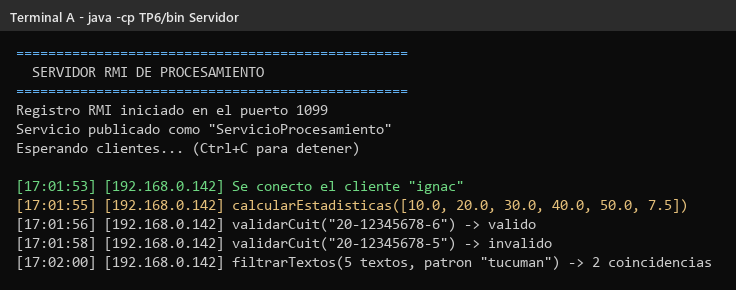
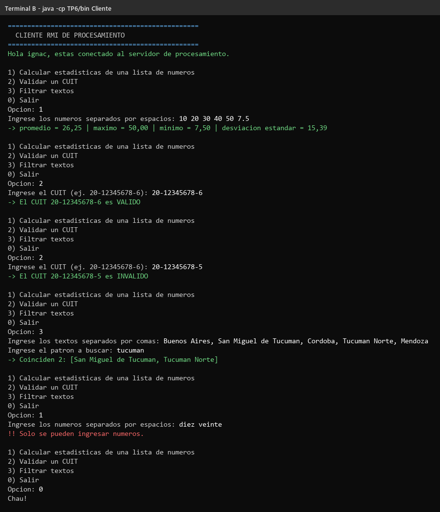
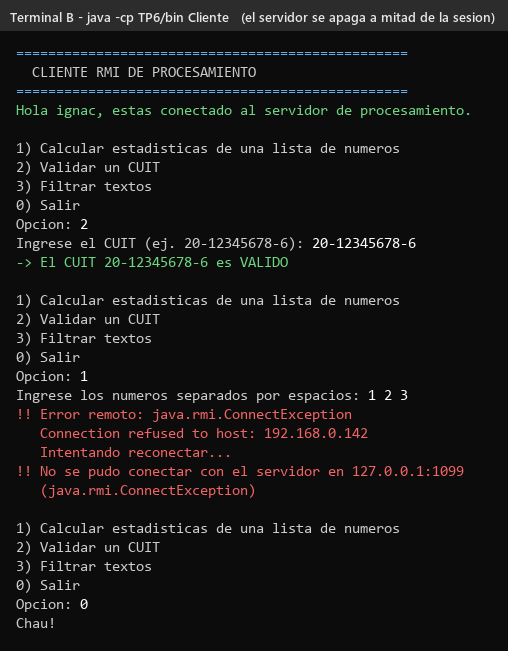

# TP6 — Servidor de procesamiento con Java RMI

Trabajo Práctico N° 6 — Desarrollo de Aplicaciones para Ambientes Distribuidos.

Un cliente con menú le pide a un servidor remoto que haga 3 tareas. Con **Java
RMI**, el cliente llama a los métodos del servidor **como si fueran métodos
comunes**, sin manejar sockets a mano.

| Método | Qué hace |
|---|---|
| `calcularEstadisticas` | Recibe una lista de números y devuelve promedio, máximo, mínimo y desviación estándar |
| `validarCuit` | Dice si un CUIT es válido (revisa el dígito verificador) |
| `filtrarTextos` | Recibe varios textos y devuelve solo los que contienen el patrón buscado |

---

## Archivos

```
TP6/
├── src/
│   ├── ServicioRemoto.java      Interfaz remota: los métodos que se pueden llamar
│   ├── ServicioRemotoImpl.java  Implementación remota: registra cada llamada y usa LogicaNegocio
│   ├── LogicaNegocio.java       Los cálculos en sí (no sabe nada de RMI)
│   ├── Estadisticas.java        El resultado de las estadísticas (viaja por la red)
│   ├── Servidor.java            Crea el registro RMI y publica el servicio
│   └── Cliente.java             Busca el servicio y muestra el menú
├── capturas/
└── README.md
```

La lógica de negocio está separada: `LogicaNegocio` hace las cuentas y
`ServicioRemotoImpl` solo se encarga de la parte remota (recibir la llamada,
registrarla en consola y devolver el resultado).

---

## Cómo compilar y ejecutar

Desde la carpeta raíz del repositorio:

```bash
javac -d TP6/bin TP6/src/*.java
```

**Terminal A — servidor:**

```bash
java -cp TP6/bin Servidor
```

Crea el registro RMI en el puerto **1099** y publica el servicio con el nombre
**`ServicioProcesamiento`**.

**Terminal B — cliente:**

```bash
java -cp TP6/bin Cliente                  # servidor en esta misma compu
java -cp TP6/bin Cliente 192.168.0.142    # servidor en otra compu de la red
```

Aparece un menú: se elige una opción, se cargan los datos y el resultado lo
calcula el servidor.

---

## Capturas

### 1. Servidor

Publica el servicio y muestra cada cliente que se conecta y cada operación que
ejecuta.



### 2. Cliente usando el menú

Estadísticas, un CUIT válido, uno inválido y un filtro de textos. Si se cargan
letras en vez de números, el cliente avisa sin llamar al servidor.



### 3. El servidor se apaga mientras el cliente está abierto

El cliente no se cuelga ni se cierra: atrapa la `java.rmi.ConnectException`,
avisa e intenta reconectarse.



> Las salidas completas también están como `.txt` en `capturas/`.

---

## Ejercicio 2 — Preguntas

### 1. ¿Qué diferencia hay entre usar sockets y usar RMI? ¿Qué nos ahorra el middleware?

**Con sockets** (como en el TP1 o el TP4) hay que hacer todo a mano: abrir la
conexión, inventar un formato para los mensajes (`15;+;30`), convertir los
datos a texto o bytes, mandarlos, leer la respuesta, volver a convertirla y
cerrar la conexión.

**Con RMI** el cliente simplemente escribe:

```java
Estadisticas e = servicio.calcularEstadisticas(numeros);
```

y parece una llamada normal. El middleware (RMI) se encarga solo de:

- Abrir y cerrar las conexiones.
- Convertir los parámetros y el resultado para que viajen por la red, incluso
  objetos como `Estadisticas` (marshalling y unmarshalling).
- Saber a qué método llamar del lado del servidor.
- Encontrar el servicio por su nombre (el registro RMI), sin saber dónde está
  el objeto realmente.
- Atender a varios clientes a la vez.
- Avisar los errores de red con una excepción (`RemoteException`).

### 2. ¿Qué es el Stub y qué es el Skeleton?

- **Stub (del lado del cliente):** es un "representante" del objeto remoto.
  Cuando el cliente hace `lookup`, recibe un stub que tiene los mismos métodos
  que `ServicioRemoto`. Cuando el cliente llama a un método, el stub
  **empaqueta** el nombre del método y los parámetros (marshalling), los manda
  por la red, espera la respuesta y la **desempaqueta** (unmarshalling) para
  devolverla como si nada.
- **Skeleton / Dispatcher (del lado del servidor):** recibe ese paquete, lo
  **desempaqueta**, llama al método real en `ServicioRemotoImpl`, **empaqueta**
  el resultado y lo manda de vuelta.

```
Cliente → Stub → (red) → Skeleton → ServicioRemotoImpl
Cliente ← Stub ← (red) ← Skeleton ← resultado
```

En Java moderno no hace falta escribir ni generar estas clases: RMI las crea
solo cuando se ejecuta el programa. Por eso alcanza con `extends
UnicastRemoteObject`.

### 3. ¿Qué le pasa al cliente si el servidor se cae en medio de una llamada?

Todos los métodos remotos declaran `throws RemoteException`, así que **Java
obliga** a manejar este caso. Según cuándo se cae el servidor, la excepción es
distinta (los dos primeros casos los probamos):

| Cuándo se cae | Excepción que recibe el cliente |
|---|---|
| Antes de la llamada (el servidor ya estaba apagado) | `java.rmi.ConnectException` — "Connection refused" (captura 3) |
| **Durante** la llamada (mientras el servidor procesaba) | `java.rmi.UnmarshalException` — "Error unmarshaling return header": la conexión se cortó antes de que llegara la respuesta |
| El servidor se reinició y el cliente usa la referencia vieja | `java.rmi.NoSuchObjectException`: ese objeto ya no existe en el servidor |

Las tres son tipos de `RemoteException`.

Lo importante es que si se cae **durante** la llamada, el cliente **no sabe si
la operación se hizo o no**. Puede que el servidor la haya terminado y se haya
caído justo antes de contestar.

**Cómo manejarlo en un sistema real:**

- **Atrapar la `RemoteException`** y mostrar un mensaje claro en vez de que el
  programa se rompa (como hace este cliente).
- **Volver a buscar el servicio** en el registro, porque la referencia vieja ya
  no sirve (este cliente lo intenta solo).
- **Reintentar con espera creciente** (como en el TP2), pero solo si repetir
  la operación no causa problemas. Calcular estadísticas o validar un CUIT se
  puede repetir sin drama. Un pago o una transferencia **no**: se podría cobrar
  dos veces.
- **Ponerle un tiempo máximo a las llamadas** para que el cliente no se quede
  esperando para siempre si el servidor se cuelga.
- **Registrar el error** (log) para poder revisar después qué pasó.

---

## Autor

Ignacio Ruiz — DNI 39.040.338
Trabajo Práctico N° 6 — Desarrollo de Aplicaciones para Ambientes Distribuidos
